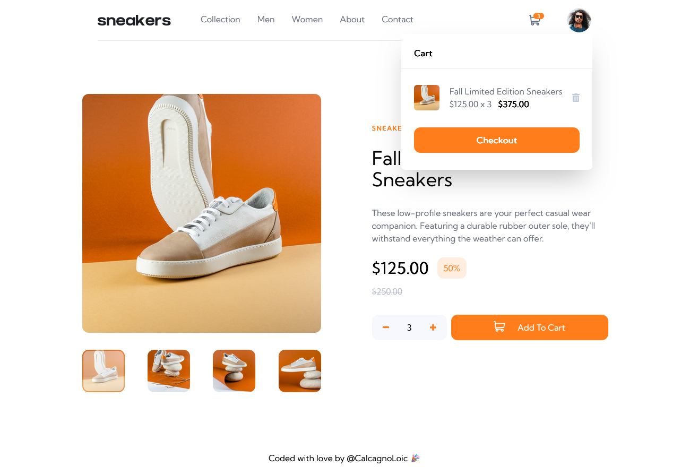
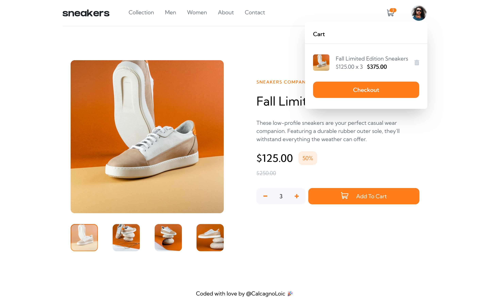
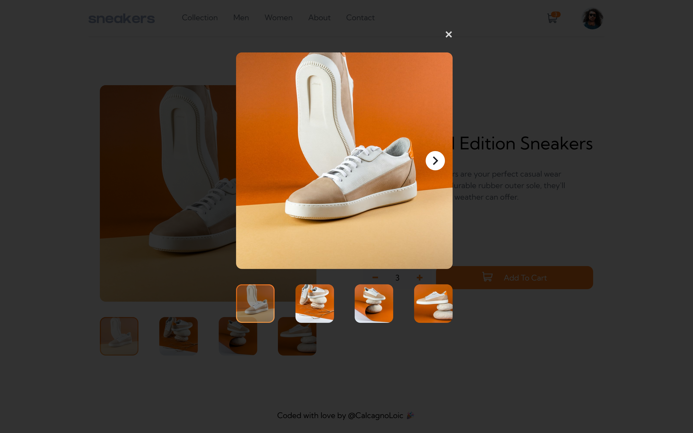

# Sneakers Company E-Commerce

Building an e-commerce site with ReactTS. The principle of Component Drivent Design with the creation of Storybook stories.

  

    

## User Stories

Users should be able to:

- View the optimal layout for the site depending on their device's screen size
- See hover states for all interactive elements on the page
- Open a lightbox gallery by clicking on the large product image
- Add items to the cart
- View the cart and remove items from it

    
    

## Built with

- Semantic HTML5 markup
- Mobile-first workflow
- TailwindCSS
- React
- Storybook

## Author

- Website - [Portfolio](https://calcagno-loic.netlify.app/)
- Frontend Mentor - [@CalcagnoLoic](https://www.frontendmentor.io/profile/CalcagnoLoic)